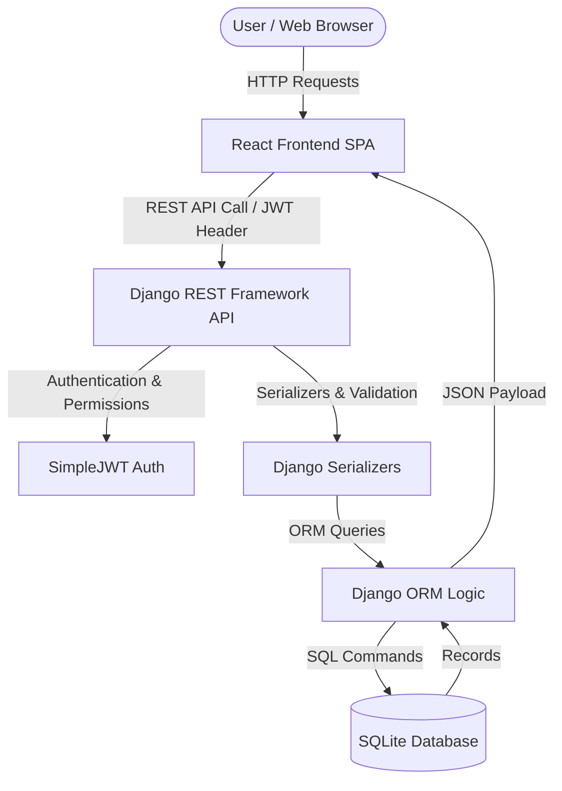
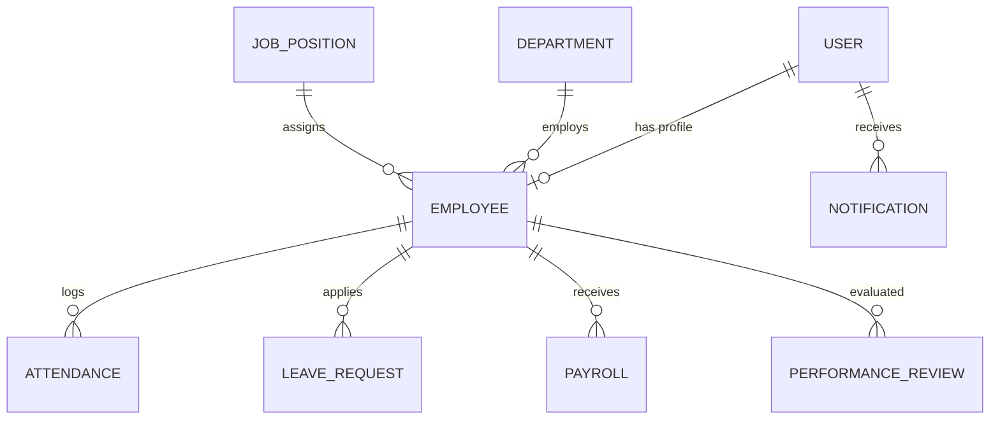

# Employee Management System

🔗 **GitHub Repository Link**: [https://github.com/syokeswaran95-droid/EMPLOYEE-MANAGMENT-SYSTEM.git](https://github.com/syokeswaran95-droid/EMPLOYEE-MANAGMENT-SYSTEM.git)

---

## Project Overview
The **Employee Management System (EMS)** is a full-stack academic web application designed to digitize human resource management, employee record tracking, attendance logs, leave management workflows, salary payroll processing, performance reviews, and operational reporting.

Built following the **Standard Operating Procedure (SOP) - Complete CRUD-Based Web Application Development**, the system features a RESTful architecture powered by **Django REST Framework (DRF)** and **SQLite** on the backend, and an interactive **React.js** frontend with **Recharts** analytics and **Lucide React** icon sets.

---

## Key Objectives
- **Full CRUD Capabilities**: Create, Read, Update, and Delete operations across all core entities (Employees, Departments, Positions, Attendance, Leaves, Payroll, Performance, Notifications).
- **Role-Based Access Control (RBAC)**: Support for 5 distinct roles (Admin, HR Manager, Department Manager, Payroll Officer, Employee) with backend token authentication and frontend route scoping.
- **Dynamic Database Persistence**: SQLite integration via Django ORM (no hard-coded frontend state arrays or localStorage persistence for main app data).
- **Automated Workflow Notifications**: Real-time in-app alerts triggered by leave requests, approvals, payroll issuance, and performance reviews.
- **Data Analytics & Reports**: Visual dashboard charts and downloadable CSV reports computed dynamically from database models.

---

## Technology Stack

| Layer | Technologies Used |
|---|---|
| **Frontend** | React.js, React Router v6, Axios, Lucide React, Recharts, Vite |
| **Backend** | Python 3, Django 6, Django REST Framework (DRF), SimpleJWT |
| **Database** | SQLite3 with Django ORM |
| **Authentication** | JWT (JSON Web Tokens) with Role Claims |
| **API Testing** | Postman REST API Collection |

---

## System Architecture



---

## Entity-Relationship (ER) Diagram



---

## User Roles & Credentials

The system comes pre-seeded with test accounts for instant academic evaluation:

| Role | Username | Password | Key Permissions |
|---|---|---|---|
| **Admin** | `admin` | `admin123` | Full access to all modules, system configuration, user accounts, and reports. |
| **HR Manager** | `hr_manager` | `hr123` | Manage employees, departments, job positions, leave approvals, attendance, and reviews. |
| **Department Manager** | `dept_manager` | `manager123` | Department-scoped view of staff, leave reviews, attendance, and performance logs. |
| **Payroll Officer** | `payroll_officer` | `payroll123` | Employee salary records, payroll generation, status tracking, and payslip management. |
| **Employee** | `arun_kumar` | `emp123` | Personal profile view, clock attendance, apply for leave, view payslips & notifications. |

---

## Installation & Setup Guide

### 1. Backend Setup (Django)

Navigate to the `backend/` directory:
```bash
cd backend
```

Install Python dependencies:
```bash
python -m pip install django djangorestframework django-cors-headers djangorestframework-simplejwt pillow
```

Run database migrations:
```bash
python manage.py migrate
```

Seed initial demonstration data:
```bash
python seed_data.py
```

Start the Django REST backend server:
```bash
python manage.py runserver 8000
```
*(The backend API will run at `http://localhost:8000/api/`)*

---

### 2. Frontend Setup (React)

Navigate to the `frontend/` directory in a new terminal window:
```bash
cd frontend
```

Install npm dependencies:
```bash
npm install
```

Start the Vite React development server:
```bash
npm run dev
```
*(The frontend app will run at `http://localhost:5173/`)*

---

## REST API Catalog

| Method | Endpoint | Description |
|---|---|---|
| `POST` | `/api/auth/login/` | Obtain JWT Access and Refresh tokens with user role metadata |
| `GET` | `/api/auth/profile/` | Retrieve current authenticated user profile |
| `GET` / `POST` | `/api/employees/` | List all employees (search/filter) or create new employee |
| `GET` / `PATCH` / `DELETE` | `/api/employees/{id}/` | Retrieve detail, edit fields, or delete employee record |
| `GET` / `POST` | `/api/departments/` | Department listing and creation |
| `GET` / `POST` | `/api/positions/` | Job position listing and creation |
| `GET` / `POST` | `/api/attendance/` | Fetch attendance logs or mark new attendance |
| `GET` / `POST` | `/api/leaves/` | View leave requests or submit new leave application |
| `PATCH` | `/api/leaves/{id}/` | Approve or reject leave request (triggers auto-notification) |
| `GET` / `POST` | `/api/payroll/` | List payroll records or compute new monthly payroll |
| `GET` / `POST` | `/api/performance/` | View or create employee performance evaluations |
| `GET` / `PATCH` | `/api/notifications/` | View user notifications or mark alerts as read |
| `GET` | `/api/dashboard/` | Executive dashboard analytics & metrics summary |
| `GET` | `/api/reports/` | Detailed analytical reports for departments, leaves, and payroll |

---

## Postman API Testing
A Postman collection is located at:
`postman/employee-management.postman_collection.json`

Import this JSON file into Postman to test authentication headers, CRUD operations, leave workflows, and dashboard REST responses.
